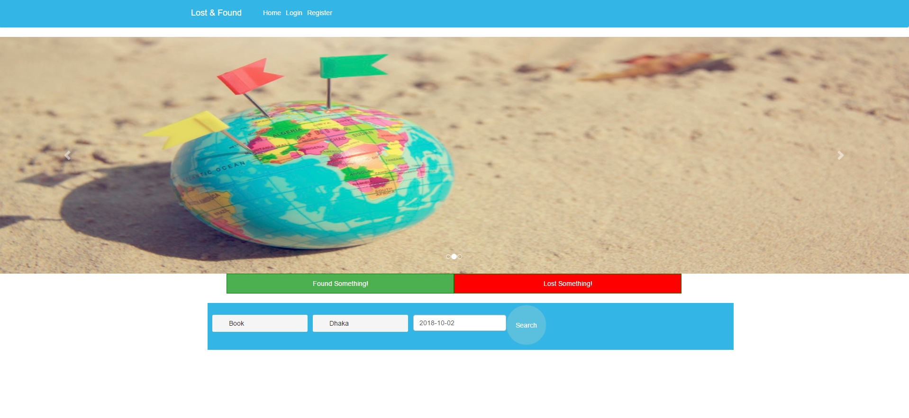
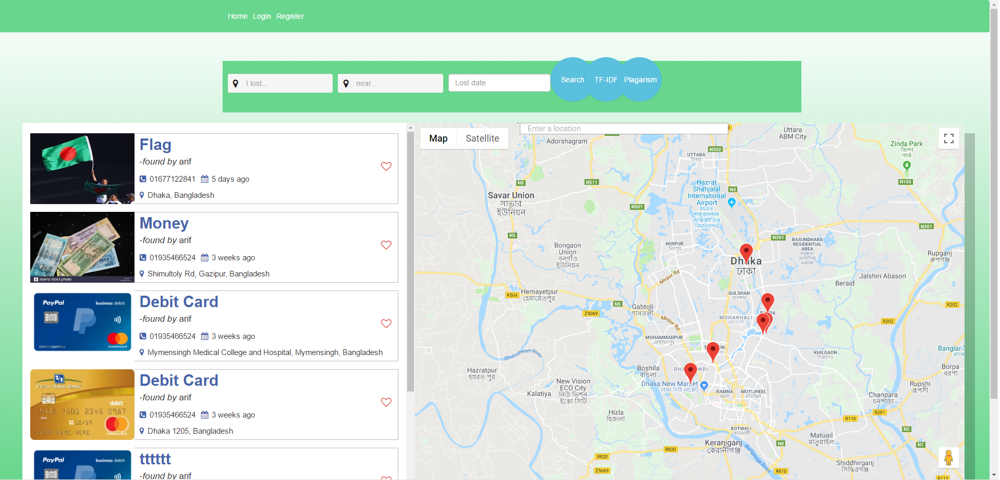

# Lost-and-Found
It is a web application where user can post, search and view their lost item as well as location side by side in the google map; where a marker will be added with every post location. There is two section one for the lost post’s and one for the found post’s.

<b>Used Tools</b>
<ul>
  <li>Laravel<li>
  <li>PHP 7.1.20</li>
  <li>MySQL</li>
  <li>Ajax</li>
  <li>Javascript</li>
  <li>jQuery</li>
</ul>

<h4>Front page</h4>
 
<h4>Lost Post page</h4>
 
